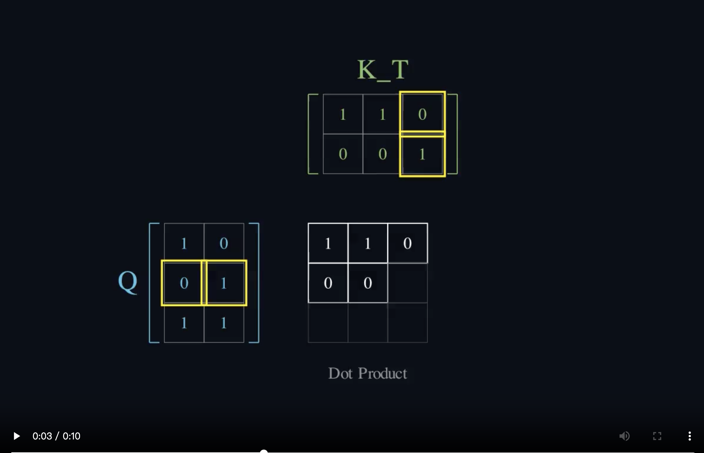

# 🧬 Transformer & Mamba Architecture Explorer

> **"What I cannot create, I do not understand."** — Richard Feynman

这是一个深度学习可视化项目，旨在通过 **交互式推导 (Streamlit)** 与 **数学原理动画 (Manim)**，深度解构 Transformer 与 Mamba (SSM) 的核心机制。

附录一个我们团队做的一个[笔记库](https://github.com/just-for-dream-0x10/beginML/tree/master/other/Self-Attention)




## 📚 核心功能

1.  **Manim 动画影院**：
    *   **Transformer 核心组件**:
        *   [Encoder Flow (编码器流)](./assets/EncoderFlow.mp4)
        *   [Decoder Masking (解码器掩码)](./assets/DecoderMasking.mp4)
        *   [Cross Attention (交叉注意力)](./assets/CrossAttentionFlow.mp4)
        *   [Multi-Head Attention (多头注意力)](./assets/MultiHeadDetailed.mp4)
        *   [Positional Encoding (位置编码)](./assets/PositionalEncoding.mp4)
        *   [Residual & Norm (残差与归一化)](./assets/ResidualNorm.mp4)
        *   [FFN & SwiGLU (前馈网络)](./assets/FFNSwiGLU.mp4)
    *   **Mamba & SSM**:
        *   [Mamba Mechanism (Mamba 机制)](./assets/MambaMechanism.mp4)
        *   [Transformer vs Mamba (架构对比)](./assets/TransformerVsMamba.mp4)
        *   [Discretization (离散化)](./assets/DiscretizationVisual.mp4)
    *   **训练与优化**:
        *   [AdamW Optimizer (优化器)](./assets/AdamWOptimizer.mp4)
        *   [BPE Tokenization (分词)](./assets/BPEDetailed.mp4)
        *   [Mixed Precision (混合精度)](./assets/MixedPrecision.mp4)
        *   [RoPE Math (旋转位置编码)](./assets/RoPEMath.mp4)
        *   [Training Loss (训练损耗)](./assets/TrainingLoss.mp4)
2.  **交互式实验室**：
    *   手动输入文本，查看 Embedding/Q/K/V 矩阵数值。
    *   **Mamba 递归模拟器**：亲手调整参数，观察隐状态 $h_t$ 的演变。
3.  **硬核笔记**：包含从数学推导到工程实现的完整文档。

## 🛠️ 安装与运行


### 1. 安装依赖
```bash
pip install -r requirements.txt
```


### 2. 生成可视化素材 (Manim)
本项目依赖 Manim 生成原理视频。请运行以下命令生成素材并移动到资源目录：
code
```Bash
# 生成基础注意力
manim -ql scene.py AttentionMechanism

# 生成架构流
manim -ql scene_struct.py EncoderFlow
manim -ql scene_struct.py DecoderMasking

# 生成协作机制
manim -ql scene_cross_attn.py CrossAttentionFlow

# 生成对比与 Mamba
manim -ql scene_compare.py TransformerVsMamba
manim -ql scene_mamba_core.py MambaMechanism
```
⚠️ 重要：Manim 默认输出在 media/videos/...，请将生成的 .mp4 文件手动复制到项目根目录的 assets/ 文件夹中。

3. 启动交互式 App

```Bash
streamlit run app.py
```


📂 目录结构
```
app.py: Streamlit 主程序 (交互界面)
scene_*.py: Manim 动画脚本 (数学原理可视化)
assets/: 存放生成的 MP4 视频资源
```

🧠 致谢
3Blue1Brown (Manim 引擎)

FlashAttention & Mamba 论文作者

---

